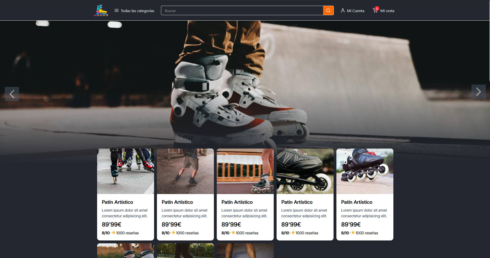

# Prime Roller Skates 🛼

E-commerce de patines en línea desarrollado con React, Tailwind CSS y Vite.
El proyecto simula una tienda online con productos, página individual de producto, carrito lateral, selección de talla, contador de unidades y consumo de imágenes desde la API de Pexels.

## 🚀 Demo

🔗 Deploy: https://prime-roller-skates.vercel.app

## 📸 Vista previa


## 🧠 Sobre el proyecto

Prime Roller Skates es un proyecto personal creado para practicar el desarrollo frontend moderno con React.  
La idea principal es construir una experiencia parecida a una tienda online real, trabajando conceptos como componentes reutilizables, rutas, estado compartido, consumo de API y lógica de carrito.

El proyecto está enfocado en aprender y demostrar habilidades de desarrollo web, especialmente en React y Tailwind CSS.

## 🛠️ Tecnologías utilizadas

- React
- Vite
- Tailwind CSS
- React Router
- React Icons
- JavaScript
- Pexels API
- Vercel CLI
- pnpm

## ✨ Funcionalidades

- Visualización de productos en la Home.
- Página individual de producto.
- Selección de talla.
- Selección de cantidad.
- Carrito lateral desplegable.
- Agrupación de productos repetidos por `id` y `size`.
- Eliminación de productos del carrito.
- Cálculo de unidades totales y precio total.
- Modal visual de inicio de sesión.
- Diseño responsive.

## Estructura
```text
E-Comerce_Cv/
├── api/
│   └── pexels.js
├── src/
│   ├── components/
│   │   ├── Header.jsx
│   │   ├── Footer.jsx
│   │   ├── ProductCardSkeleton.jsx
│   │   └── CategoryGridSkeleton.jsx
│   ├── pages/
│   │   ├── Home.jsx
│   │   └── Product.jsx
│   ├── App.jsx
│   └── main.jsx
├── package.json
└── README.md
```

## 🧩 Conceptos trabajados

Durante el desarrollo de este proyecto he practicado:

- Componentes reutilizables en React.
- Paso de props entre componentes.
- Estado compartido entre páginas.
- Manejo de arrays de objetos.
- Métodos como `map`, `find`, `filter` y `reduce`.
- Renderizado condicional.
- Formularios y eventos.
- Rutas con React Router.
- Consumo de APIs externas.
- Organización de carpetas en un proyecto React.
- Diseño responsive con Tailwind CSS.
- Deploy de una app React en Vercel.

## 🛒 Lógica del carrito

El carrito está gestionado desde un componente padre para que pueda compartirse entre diferentes páginas y componentes.
La lógica permite:

- Añadir productos desde la página de producto.
- Agrupar productos iguales por `id` y `size`.
- Crear una nueva línea si el producto tiene una talla diferente.
- Aumentar o disminuir unidades desde el carrito.
- Eliminar productos.
- Calcular el total de unidades.
- Calcular el precio total con `reduce`.

Ejemplo de estructura de un producto dentro del carrito:

```javascript
{
  id: 123,
  name: "Patín Artístico",
  price: 89.99,
  image: "...",
  quantity: 2,
  size: 40
}
```
## 🌐 API

El proyecto utiliza la API de Pexels para cargar imágenes dinámicas de productos y secciones visuales.
Las llamadas a la API están gestionadas desde una función serverless en Vercel:

```text
/api/pexels
```

La API devuelve datos para:

- Hero images
- Productos principales
- Cascos
- Protecciones
- Ruedas
- Productos combinables

## ⚙️ Instalación y ejecución local

### 1. Clona el repositorio:

```bash
git clone https://github.com/emilio-devx/CVProject.git
```

### 2. Entra en la carpeta del proyecto:

```bash
cd CVProject/E-Comerce_Cv
```

### 3. Instala dependencias:

```bash
pnpm install
```

### 4. Ejecuta el proyecto:

```bash
vercel dev
```

```md
El proyecto se ejecuta con `vercel dev` para poder probar también las funciones serverless de la carpeta `/api`, como el endpoint `/api/pexels`.

## 🔐 Variables de entorno

Para que la API de Pexels funcione, necesitas crear un archivo `.env` con tu clave:

```env
PEXELS_API_KEY=tu_api_key
```

En Vercel, esta variable debe configurarse desde el panel de Environment Variables.

## 🚧 Dificultades y aprendizajes

Durante el desarrollo me encontré con varios retos técnicos:

- Migrar parte de la lógica backend a funciones serverless de Vercel.
- Entender cómo compartir el estado del carrito entre páginas.
- Evitar que productos repetidos se dupliquen en el carrito.
- Manejar rutas y datos entre Home.jsx y Product.jsx.
- Mejorar la estructura visual del carrito lateral.
- Trabajar con datos dinámicos provenientes de una API externa.
- Calcular correctamente unidades totales y precio total del carrito.

Estos problemas me ayudaron a entender mejor cómo se estructura una aplicación React más realista.

## 🔜 Mejoras futuras
- Sustituir datos simulados por productos reales desde una base de datos.
- Añadir buscador funcional.
- Añadir filtros por categoría.
- Guardar el carrito en `localStorage`.
- Crear rutas dinámicas tipo `/product/:id`.
- Mejorar el sistema de login.
- Crear una página de checkout.
- Mejorar accesibilidad.
- Mejorar responsive en pantallas pequeñas.

## 👨‍💻 Autor

Desarrollado por Emilio Haro.

- GitHub: https://github.com/emilio-devx
- Deploy: https://prime-roller-skates.vercel.app

## Estado

Proyecto en desarrollo.
Lo uso como pieza de portfolio y como entorno de práctica para afianzar React, Tailwind, consumo de APIs y lógica de estado en React.
